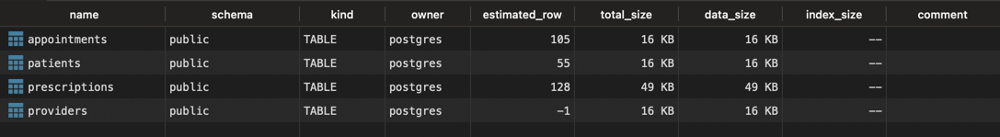
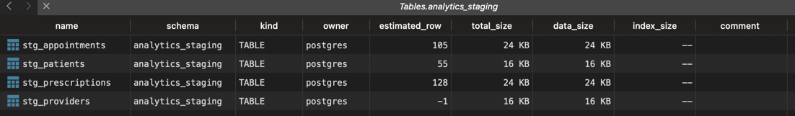
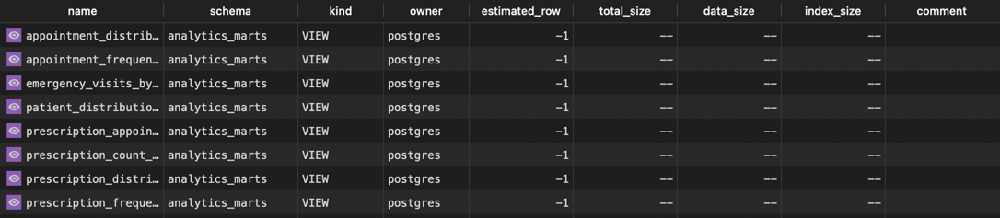

# Healthcare Analytics Pipeline

<!-- TOC -->
* [Healthcare Analytics Pipeline](#healthcare-analytics-pipeline)
  * [Data Pipeline Structure:](#data-pipeline-structure)
    * [Overview](#overview)
    * [Limitations](#limitations-)
    * [Layer Structure](#layer-structure)
    * [Data Quality](#data-quality)
    * [Technical Stack](#technical-stack)
  * [Project Setup](#project-setup)
  * [Load and Run Pipeline](#load-and-run-pipeline)
    * [1. Run all models.](#1-run-all-models)
    * [2. Run tests against your models to validate your data](#2-run-tests-against-your-models-to-validate-your-data)
    * [3. Generate DBT documentation](#3-generate-dbt-documentation)
    * [4. Dashboard.](#4-dashboard)
  * [Conclusions](#conclusions)
<!-- TOC -->
## Data Pipeline Structure:

### Overview

This DBT project implements a **Medallion architecture** (Bronze → Silver → Gold) to ingest, clean, transform, and analyze healthcare data related to patients, appointments, prescriptions, and providers.

**Why DBT?**
- Although my background experience is much more focused onn designing pipelines with, stored procedures, pandas or spark, I intentionally chose dbt as the transformation layer simply because I had limited hands-on expossure to it. I saw in this challenge a valuable opportunity to learn a modern and widely adopted data transformation framework.
- This project allows me to showcase not only my ability to deliver a working pipeline but also my how I am able to learn and adapt to anything.

**What is DBT?**
- DBT is a transformation (the T from ETL/ELT) framework that allow to build modular SQL data pipelines with best pratices, as it has built-in tests, documentation and incremental processing.

### Limitations 
- Due to time constraints I opted to keep all layers in Postgres.
- In a real-world scenario, the source would be in a OLTP database (as currently is) and Raw, Silver and Golden layers would be ingested in a OLAP database (or lake house storage).
- A production setup would ingestion tools like Airbyte, Fivetran, or Spark would extract (E) source data and load (L) it into an OLAP system. Then, dbt would perform its magic, that is:
   - Create incremental staging models that only process new or updated data
   - Data validation and cleaning logic
   - Build derived marts and analytical aggregates
   - Full pipeline lineage, documentation, and testing


### Layer Structure

- **Bronze Layer**: Raw data loaded from CSVs into PostgreSQL `public` schema
- **Silver Layer (`staging/`)**: Cleaned and enriched models:
  - Age group & patient type classification (`stg_patients`)
  - Day of week + days since last appointment (`stg_appointments`)
  - Medication category + prescription frequency (`stg_prescriptions`)
  - providers dimenension (`stg_providers`)
- **Golden Layer (`marts/`)**: Analytical views answering specific business questions


### Data Quality
- Used of incremental logic to ensure only new data from RAW is loaded to Silver
- Model contains dbt tests on unique, not_null, accepted_values, and custom SQL tests for business rules
- Used of Hash diff logic used to detect provider changes as there is no date column
- Used of Arrays in medication category as one medication can be part of more than one category
- Used of Coalesce to handle nulls

### Technical Stack

- Python 3.9+
- PostgreSQL 15 (via Docker Compose)
- dbt-core 1.9.0
- dbt-postgres 1.9.0
- Streamlit for dashboard UI
- Altair for charts in the frontend (Note: This I heavily used ChatGPT)


---

## Project Setup
1. `pip3 install -r requirements`

2. `dbt init healthcare` (not required as healthcare project already exists)
 > If it didn't exist, dbt would create new folder/project named healthcare and interactively ask for postgres credentials and store them in ~/.dbt/profiles.yml
 > For simplicity I kept within the healthcare folder (healthcare/profiles.yml) to avoid errors during your execution.
 
3. Run `docker-compose up -d` to start the PostgreSQL and Streamlit.

4. Initialize source: `python source_simulator/load_data.py` 

5. Test connection:

`cd healthcare && dbt debug`

You should see something like this:
```21:00:12  Registered adapter: postgres=1.9.0
21:00:13    Connection test: [OK connection ok]

21:00:13  All checks passed!
```

## Load and Run Pipeline

### 1. Run all models.

`dbt run`

> it will execute incremental load of the tables in public dataset to the staging and marts (views for business related insights)

- If everything worked good so far, you should have:

  **Raw**

  

  **Staging (Silver):**

  
  
  **Marts (Golden):**

  

> Optional tips:
> 
> what if I need to reload for a specific table? A change in logic change for example.
> `dbt run --select stg_prescriptions --full-refresh`
> 
> What if only need do a preview in the data before loading?
> `dbt show --select stg_prescriptions --full-refresh`

### 2. Run tests against your models to validate your data

`dbt test`

- Custom SQL tests are implemented in the `tests/` folder
- Built-in dbt-tests for unique, not_null and accepted_values in `healthcare/models/staging/schema.yml` and `healthcare/models/marts/schema.yml` files.

### 3. Generate DBT documentation

`dbt docs generate && dbt docs serve`

- Available at: http://localhost:8080/

### 4. Dashboard.
- Built using Streamlit and generated with docker composer at: http://localhost:8501/
- Connected to the PostgreSQL database using SQLAlchemy
- Displays insights from Golden layer

> It can also be executed manually by running: `streamlit run streamlit_app/healthcare_dashboard.py`
ntment

## Conclusions

- Patients 51–70 and 71+ have the highest appointment counts, particularly for checkups.
- Emergency appointments has a spike on Friday.
- Pain medications are the most prescribed medications, especially in older age groups.
- No linear correlation between prescription frequency and appointments. Further investigation is suggested, as patients with "Few" and "Moderate" prescriptions had higher appointment averages.
- First-time prescriptions declined sharply over time, while repeat prescriptions grew, indicating ongoing care.